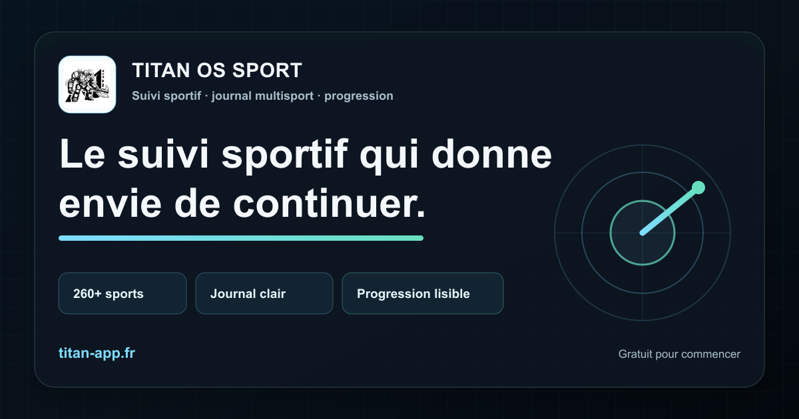
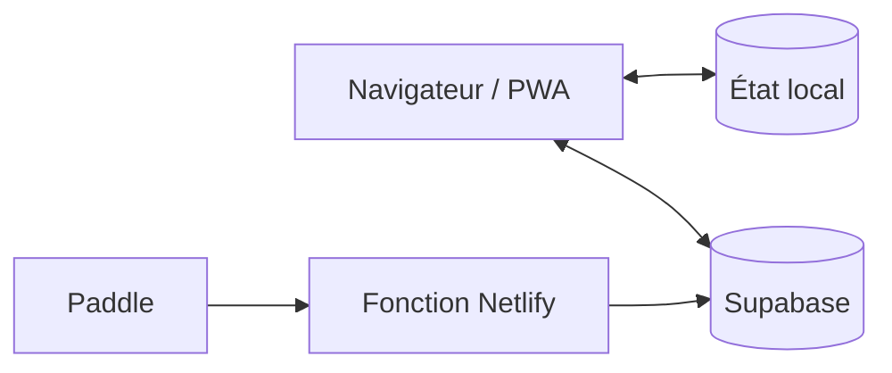

# TITAN OS Sport

Application web multisport qui réunit journal d'entraînement, statistiques, progression et gamification pour plus de 260 disciplines.

[Ouvrir l'application](https://titan-app.fr) · [Architecture](docs/ARCHITECTURE.md) · [Déploiement et reprise](docs/DEPLOYMENT.md) · [Contribuer](CONTRIBUTING.md) · [Sécurité](SECURITY.md)



## Où est l'application ?

- **Production** : [https://titan-app.fr](https://titan-app.fr)
- **Point d'entrée du code** : [`index.html`](index.html)
- **Parcours principal** : `index.html` → `training.html` → `journal.html` → `stats.html` → `profile.html`
- **Build publiable** : `dist/`, recréé par `pnpm run build` et volontairement absent de Git
- **Hébergement** : Netlify, configuré par [`netlify.toml`](netlify.toml)
- **Backend** : Supabase pour Auth/Postgres/Realtime/Storage/RPC
- **Paiement** : Paddle → fonction Netlify → RPC Supabase

Le dépôt porte le nom historique `TITAN_V0.5`. La version cohérente des assets applicatifs est actuellement `100.0` dans `js/config.js` et `sw.js`.

## Démarrer en cinq minutes

Prérequis : Node.js 22+ et pnpm 11.19.0.

```bash
git clone https://github.com/Theo25460/TITAN_V0.5.git
cd TITAN_V0.5
pnpm install --frozen-lockfile
pnpm dev
```

Ouvrir `http://127.0.0.1:8080`. Ce serveur est pratique pour le front, mais n'émule pas les redirects, headers ni fonctions Netlify.

Pour prévisualiser exactement le dossier public construit :

```bash
pnpm run build
pnpm run preview
```

Puis ouvrir `http://127.0.0.1:4173`.

## Comment ça fonctionne ?

TITAN est un site statique multi-pages sans framework front. Les pages HTML chargent un noyau JavaScript global dans un ordre précis. `js/state.js` maintient un état local-first dans `localStorage`, puis synchronise les données autorisées avec Supabase. Le service worker fournit le cache PWA et les fallbacks hors ligne.



La sécurité ne repose jamais sur le JavaScript client : les données privées, permissions, récompenses et droits TITAN+ doivent être protégés par RLS/RPC et par le serveur. Voir [`docs/ARCHITECTURE.md`](docs/ARCHITECTURE.md) pour le flux complet et l'ordre des scripts.

## Carte du dépôt

| Chemin | Rôle |
| --- | --- |
| `*.html` | Pages publiques et applicatives ; `index.html` est l'entrée. |
| `js/` | Configuration publique, UI, état, métier, PWA et modules de page. |
| `css/` | Styles globaux et styles de pages. |
| `image/` | Logos et collections visuelles ; WebP utilisé dans le build lorsqu'il existe. |
| `functions/` | Logique serveur testable, notamment le webhook Paddle. |
| `netlify/functions/` | Adaptateurs déployés par Netlify. |
| `sql/` | Scripts Supabase ; ils ne sont pas appliqués automatiquement. |
| `tools/` | Build, audit, vérification, génération et serveurs locaux. |
| `tests/` | Tests Node et contrôles de cohérence du produit. |
| `docs/` | Architecture et procédure de déploiement/reprise. |

## Commandes essentielles

| Commande | Résultat |
| --- | --- |
| `pnpm dev` | Sert les sources sur le port 8080. |
| `pnpm test` | Vérifie 65 scripts, les assets et les tests métier. |
| `pnpm run build` | Recrée le dossier public `dist/`. |
| `pnpm run preview` | Sert le dernier build sur le port 4173. |
| `pnpm run audit` | Contrôle le contenu du build ; ce n'est pas `pnpm audit`. |
| `pnpm run verify` | Lance tests, build et audit comme la CI GitHub. |

`pnpm relaunch` est un outil de transformation de release qui réécrit de nombreuses pages et le SEO. Ne pas l'utiliser comme commande de démarrage ; l'exécuter seulement sur une branche dédiée et relire entièrement le diff.

## Configuration et secrets

Le front contient volontairement l'URL et la clé publique/`anon` Supabase ainsi que des identifiants client Paddle. Ils sont visibles par tout navigateur et doivent rester limités à un usage public.

Les secrets suivants existent uniquement dans Netlify ou dans un environnement local ignoré :

- `PADDLE_WEBHOOK_SECRET`
- `SUPABASE_SECRET_KEY` ou l'ancien `SUPABASE_SERVICE_ROLE_KEY`
- `SUPABASE_DB_URL`
- les vraies valeurs d'environnement copiées depuis [`.env.example`](.env.example)

Pour identifier l'offre TITAN+ sans heuristique, configurer aussi `PADDLE_ELITE_PRODUCT_IDS` et/ou `PADDLE_ELITE_PRICE_IDS`.

## Qualité et publication

Chaque push et pull request vers `main` exécute la CI dans `.github/workflows/ci.yml`. Avant fusion :

```bash
pnpm run verify
```

La présence d'un script dans `sql/` ne prouve pas qu'il est appliqué. Consulter [`PUBLIC_RELEASE_SQL_ORDER.md`](PUBLIC_RELEASE_SQL_ORDER.md), puis valider l'état réel dans Supabase. Le déploiement complet et le retour arrière sont décrits dans [`docs/DEPLOYMENT.md`](docs/DEPLOYMENT.md).

## État de reprise

Dernière validation locale : **11 septembre 2026**.

- tests automatiques : réussis ;
- build public : réussi ;
- audit public : aucun constat ;
- application publique : accessible sur `titan-app.fr` ;
- limites : pas encore d'E2E complet sur Supabase/Netlify/Paddle réels et historique SQL non structuré en migrations automatiques.

Commencer toute reprise par ce README, puis lire `docs/ARCHITECTURE.md` et `docs/DEPLOYMENT.md`. Les documents `TITAN_REPRISE_CONTEXTE.md` et `README_TITAN_OS.md` conservent du contexte historique, mais ne remplacent pas ces trois sources actuelles.

## Licence

Aucune licence open source n'est accordée à ce stade. Le dépôt est consultable publiquement, mais les droits de réutilisation ne sont pas concédés.
