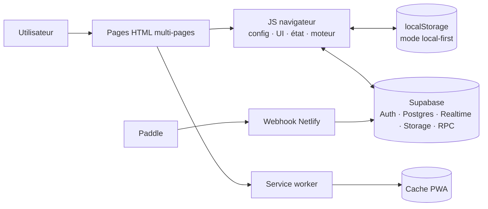

# Architecture de TITAN OS Sport

Ce document décrit l'état réel du dépôt à la version d'assets `100.0`. Le nom historique du dépôt reste `TITAN_V0.5`.

## Vue d'ensemble

Le front est volontairement sans framework ni bundler. Les pages HTML racine chargent des scripts classiques qui exposent des fonctions et états sur `window`. Cette simplicité rend l'ordre de chargement contractuel.

## Entrées et parcours

- `index.html` : entrée publique, tableau « Aujourd'hui » si un état utilisateur existe.
- `training.html` : création d'une séance.
- `journal.html` : historique personnel, liste et calendrier.
- `stats.html` : tendances et progression.
- `profile.html` : compte, préférences et identité sportive.
- `sports.html` et `disciplines.html` : catalogue et sports suivis.
- `adventure.html`, `talents.html`, `trophies.html`, `boutique.html` : couche de gamification.
- `social.html` et `chat.html` : fonctions sociales et temps réel.
- `admin.html` : console réservée aux autorisations admin côté base.
- `dynamic-page.html` : contenu public piloté par les données.

Le parcours principal est : **Aujourd'hui → Enregistrer → Journal → Progrès → Profil**.

## Ordre des scripts navigateur

Une page applicative charge généralement :

1. les CDN requis, notamment Supabase ;
2. `js/titan-v100.js` pour les fondations transverses ;
3. `js/config.js` ;
4. `js/data.js` et, si nécessaire, `js/sport-discovery.js` ;
5. `js/ui.js` ;
6. `js/state.js` ;
7. `js/titan_features.js` ;
8. `js/main.js` ;
9. le module de page ou le script inline.

`config.js` doit précéder les accès aux versions, clés et options. `state.js` doit précéder les rendus qui lisent `window.state`. `main.js` dépend de l'état hydraté et de fonctions de sauvegarde. Changer cet ordre sans test multi-pages peut produire des erreurs silencieuses.

## État et données

`js/state.js` gère un état local-first dans `localStorage`, puis hydrate et synchronise les données autorisées avec Supabase. Le site peut conserver certaines fonctions en mode invité ou lorsque le réseau est indisponible. Le navigateur n'est jamais la source de vérité pour les droits admin, les entitlements payants ou les récompenses sensibles.

Les scripts SQL sont actuellement stockés à plat dans `sql/`. Il n'existe pas encore de répertoire `supabase/migrations/` reproductible. [`PUBLIC_RELEASE_SQL_ORDER.md`](../PUBLIC_RELEASE_SQL_ORDER.md) décrit l'ordre opérationnel ; il faut vérifier dans le projet Supabase ce qui a réellement été appliqué.

## Paiement et entitlement

`netlify/functions/webhook.mts` réexporte `functions/webhook.mjs`. Le webhook :

1. accepte uniquement `POST` et limite la taille du corps ;
2. vérifie la signature et la fraîcheur Paddle ;
3. journalise l'événement de façon idempotente ;
4. identifie explicitement les produits TITAN+ ;
5. appelle une RPC Supabase ordonnée pour attribuer ou retirer le droit.

Les clés serveur sont injectées par Netlify et ne doivent jamais être copiées dans `js/config.js`.

## Build et PWA

`tools/build-public.mjs` recrée `dist/` à partir des pages racine, de `css/`, de `js/` et des images publiques. Il exclut les outils, SQL, fonctions sources et documents internes. Dans les collections avatar/boss/mob, une image WebP remplace son original PNG/JPEG dans le build lorsqu'un fichier frère existe.

`sw.js` met en cache le shell PWA et applique des stratégies différentes aux navigations et aux assets. Toute nouvelle version doit garder cohérents le nom du cache, `js/config.js`, les query strings des pages et les assets précachés.

## Limites connues

- Plusieurs gros fichiers reposent sur des globals et des scripts inline ; le risque de couplage inter-pages est réel.
- Les tests couvrent la syntaxe, les assets et quelques règles métier, mais pas encore un parcours E2E avec Supabase, Netlify et Paddle réels.
- Le serveur local ne reproduit pas exactement les redirects, headers CSP ni fonctions Netlify.
- L'état des scripts SQL en production doit être confirmé manuellement.
