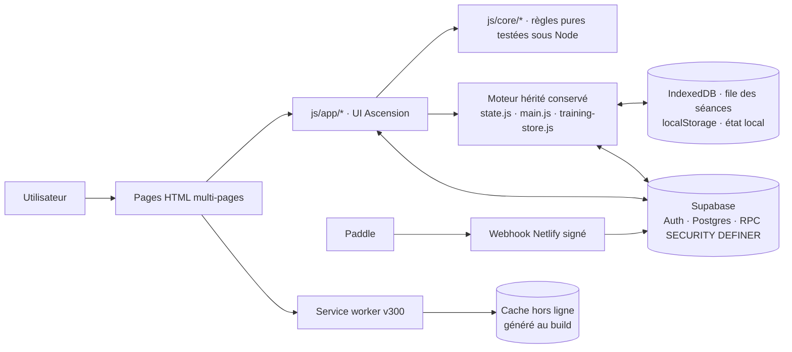

# Architecture de TITAN

État réel du dépôt à la version **300.0 (Ascension)**. Le nom historique du dépôt reste `TITAN_V0.5`. Les règles produit et les chiffres de progression sont dans [`ASCENSION_300.md`](ASCENSION_300.md) ; la mise en production dans [`DEPLOYMENT.md`](DEPLOYMENT.md).

## Vue d'ensemble

```mermaid
flowchart LR
    U[Utilisateur] --> P[Pages HTML multi-pages]
    P --> APP[js/app/* · UI Ascension]
    APP --> CORE[js/core/* · règles pures testées sous Node]
    APP --> ENG[Moteur hérité conservé<br/>state.js · main.js · training-store.js]
    ENG <--> IDB[(IndexedDB · file des séances<br/>localStorage · état local)]
    APP & ENG <--> S[(Supabase<br/>Auth · Postgres · RPC SECURITY DEFINER)]
    W[Paddle] --> N[Webhook Netlify signé] --> S
    SW[Service worker v300] --> K[(Cache hors ligne<br/>généré au build)]
    P --> SW
```

Pas de framework ni de bundler. Les scripts sont classiques (IIFE/UMD) et exposent leurs API sur `window` ; les modules `js/core/*` exportent aussi pour Node (`module.exports`) afin d'être testés.

## Pages

| Espace | Pages | Module |
| --- | --- | --- |
| QG | `aujourdhui.html` | `js/app/qg.js` |
| Progrès | `stats.html` (Semaine), `journal.html`, `records.html`, `objectifs.html` | `semaine.js`, `journal.js`, `records.js`, `objectifs.js` |
| Séance | `training.html`, `prevoir.html` | `seance.js`, `moment.js`, `prevoir.js` |
| Aventure | `adventure.html` | `aventure.js` (+ `renaissance-engine.js`, `renaissance-catalog.js`) |
| Profil | `profile.html` | `profil.js`, `card.js` (images), QR à la demande |
| Secondaires | `social.html`, `coaching.html`, `boutique.html` (Atelier), `service.html` (Aide) | `communaute.js`, `coaching.js`, `atelier.js` |
| Accès | `login.html`, `onboarding.html`, `update-password.html` | `auth.js`, `onboarding.js`, `update-password.js` |
| Public | `index.html`, guides, tarifs, légal, sports, 404 | générés (voir plus bas) |
| Carte publique | `athlete.html` servie sur `/u/<lien>` | `athlete.js` |
| Interne | `admin.html`, `dynamic-page.html` | hérités, non indexés |

Le shell (`js/app/shell.js`) dessine la barre du haut, la barre d'onglets mobile, le rail ordinateur, le menu « Plus », les feuilles (`sheet`), confirmations et toasts. Une page sans navigation déclare `data-shell="none"`.

## Ordre des scripts d'une page de l'app

`supabase` → `config.js` → `data.js` → `app/icons.js` → `ui.js` → `training-store.js` → `state.js` → `titan_features.js` → `main.js` → `renaissance-catalog.js` → `renaissance-engine.js` → `sport-insights.js` → `core/*` → `app/data.js` → `app/shell.js` → `app/analytics.js` → modules de la page → `pwa.js`.

`state.js` et `main.js` (hérités) gardent la synchronisation : file IndexedDB (`TitanQueue`), idempotence par `client_event_id`, reçus serveur. Ils ne sont pas réécrits : c'est le moteur fiable de l'application.

## Règles et données

- `js/core/effort.js` : minutes d'effort, XP v300, plafonds, rangs, niveau. Le serveur applique la même formule (`titan_effort_v300`) et fait foi.
- `js/core/progress.js` : séances actives, maîtrise, cadence, ADN, repères (`insights`) avec leur raison.
- `js/core/questions.js` : les questions du récap hebdomadaire.
- `js/core/sports.js` + `sports-catalog.js` : 260 sports hors ligne, familles, recherche avec synonymes.
- Les récompenses, achats, apparences, amitiés, partages, défis, expéditions, cartes publiques et suppressions passent par des RPC `SECURITY DEFINER` à `search_path` fixé. Le navigateur n'écrit jamais l'XP, les crédits, les droits ni la possession.

## Base de données

- Migrations versionnées dans `supabase/migrations/` ; celles de la v300 commencent à `20261005150000`.
- **Banc local** : `pnpm run test:db` crée un Postgres vierge, charge la structure de production (`tools/db/baseline`, sans données), rejoue les migrations en attente puis `sql/tests/300_*.sql` (transactions annulées). Procédure de rafraîchissement du snapshot : [`../tools/db/README.md`](../tools/db/README.md).
- Tâches planifiées (pg_cron) : purge des messages expirés, purge des comptes réellement inactifs (règle v300), purge des statistiques d'usage de plus de 13 mois.

## Site public

- `tools/build-public-site.mjs` : accueil, tarifs, fonctionnalités, guides (niveaux, aventure, données, démarrage, coachs), sitemap. Les chiffres (XP typique, délais de rang) sont **calculés** depuis `js/core/effort.js`.
- `tools/build-public-docs.mjs` : confidentialité, CGU, mentions, centre de confiance, aide, nouveautés, catalogue des sports, partenariats, guides par sport, 404.
- Gabarit commun : `tools/lib/public-template.mjs`, styles `css/public.css` sur les jetons de `css/ascension.css`.
- Identité : `tools/render-brand-v300.mjs` (icônes, favicon, image sociale) et `tools/make-thumbs.mjs` (portraits, gardiens et mondes allégés).

## Build, PWA, Android

- `tools/build-public.mjs` recrée `dist/`, exclut outils, SQL et documents, puis **génère la liste hors ligne du service worker** à partir des ressources réellement chargées par les 14 pages de l'app (le build échoue si une entrée manque). Avec `TWA_SHA256_FINGERPRINTS`, il écrit aussi `/.well-known/assetlinks.json`.
- `sw.js` : réseau d'abord pour les pages (repli cache puis page hors ligne), cache d'abord avec revalidation pour les ressources. Désactivé sur `localhost` sauf `localStorage.titan_sw_dev = "1"`.
- Android : Trusted Web Activity, voir [`ANDROID.md`](ANDROID.md).

## Tests

- `pnpm test` : syntaxe des scripts, références d'assets, règles métier (effort, progression, questions, parité avec l'ancien moteur, intégrité des séances, webhook).
- `pnpm run test:e2e` : Chromium sur le site construit (accueil, séance invité jusqu'au journal et au récap, validation, noindex, 360 px, hors ligne réel).
- `pnpm run test:db` : migrations et tests SQL sur une réplique vide.
- CI GitHub : les trois.

## Limites connues

- Les pages de l'app chargent encore le moteur hérité (~205 Ko compressés de JS) ; le service worker le met en cache après la première visite.
- `admin.html` et `dynamic-page.html` gardent l'ancien style.
- Le serveur local ne reproduit pas les en-têtes CSP ni la fonction Netlify.
